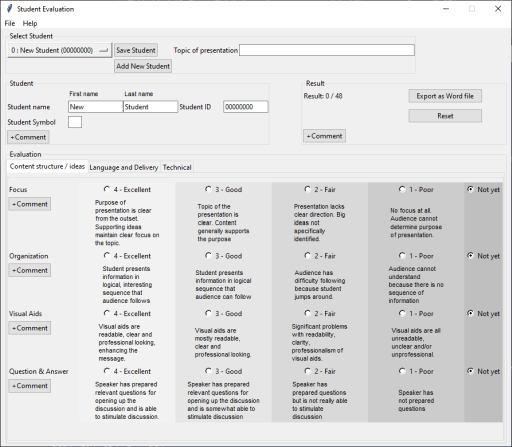

# Student Evaluation



## Objective of the Project

The purpose of this project is to develop Windows Desktop App by python with tkinter. This is a part of learning User Experience Process as a group assignment on the Software User Experience courst at Auckland Inssitute of Studies.

## Objective of the app

This application is to help lecturers to evaluate students.

## Requirements

- Python 3.8 or later.

## Installing

```
pip install bayoo-docx
```

## License

GPL v3

## Links

- https://www.ais.ac.nz/
- https://www.python.org/downloads/windows/
- https://pypi.org/project/bayoo-docx/
- https://python-docx.readthedocs.io/en/latest/
- https://cdn.ncte.org/nctefiles/resources/books/sample/standardsdoc.pdf
